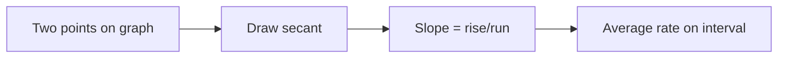

# Day 1 — Average rate of change and secant slope

## Day objectives

- Interpret **average rate of change** of \(y=f(x)\) on \([a,b]\) as the slope of the **secant line** through \((a,f(a))\) and \((b,f(b))\).
- Carry **units** correctly (output units per input unit).
- Read steepness and sign of slope as “how fast \(y\) changes relative to \(x\)” on an interval.

### Khan Academy

  <iframe width="560" height="315" src="https://www.youtube.com/embed/0z_MDIWMBwU" title="Khan Academy: Secant lines and average rate of change" loading="lazy" allow="accelerometer; autoplay; clipboard-write; encrypted-media; gyroscope; picture-in-picture; web-share" referrerpolicy="strict-origin-when-cross-origin" allowfullscreen></iframe>

## Prime recall (answer before reading on)

1. What does “slope between two points on a graph” measure about the function **on the interval** between those \(x\)-values?
2. If \(f(1)=3\) and \(f(5)=11\), what is the average rate of change of \(f\) from \(x=1\) to \(x=5\)?

---

## Core concepts

For a function \(f\) defined at \(x=a\) and \(x=b\), the **average rate of change** of \(f\) on \([a,b]\) is

\[
\frac{f(b)-f(a)}{b-a}.
\]

Geometrically, this is the slope of the **secant line** through \((a,f(a))\) and \((b,f(b))\). It answers: “If \(y\) changed at a constant rate over \([a,b]\), what constant rate would match the net change \(f(b)-f(a)\)?”

**Units:** If \(x\) is in minutes and \(y\) is in meters, the average rate is meters per minute.

**Sign:** Negative average rate means net decrease over the interval (secant tilts downward).

<!-- FUTURE: draggable secant points on a curve; slope readout -->

## Figure 1 — From secant slope to “rate language”

**Takeaway:** Average rate is a **global** summary over an interval; it is not (yet) the instantaneous rate at one time.

### Visual

| Quantity | Meaning |
|----------|---------|
| \(f(b)-f(a)\) | Net change in output |
| \(b-a\) | Length of input interval |
| \(\dfrac{f(b)-f(a)}{b-a}\) | Average output change per unit input |

---

## Mini-challenge

**Prompt:** A cost function \(C(q)\) dollars gives the cost to produce \(q\) items. Explain in plain language what \(\dfrac{C(120)-C(80)}{120-80}\) measures, including units.

### Hints

- Name what \(q\) and \(C(q)\) represent.
- Average rate always pairs \(\Delta\text{output}\) with \(\Delta\text{input}\).

Show one possible solution path

It is the **average cost increase per additional item produced** over the production interval from 80 to 120 items—measured in **dollars per item**, because dollars change per item produced. It is **not** necessarily the marginal cost at any single \(q\) unless cost were exactly linear.

---

## Active recall

1. Why is the order \(f(b)-f(a)\) in the numerator paired with \(b-a\) in the denominator (not reversed)?
2. Give an applied scenario where a **negative** average rate is meaningful.
3. Secant slope vs tangent slope: which one is defined using **two** points?

---

## Practice problems

### Problem 1

Let \(f(x)=x^2+1\). Find the average rate of change of \(f\) on \([0,2]\).

*Your work:*

Show solution

\[
\frac{f(2)-f(0)}{2-0}=\frac{(4+1)-(0+1)}{2}=\frac{4}{2}=2.
\]

### Problem 2

The position of a particle along a line is \(s(t)=t^3-6t\) meters, with \(t\) in seconds. Find the average velocity from \(t=1\) to \(t=3\).

*Your work:*

Show solution

Average velocity is \(\dfrac{s(3)-s(1)}{3-1}\). Compute \(s(3)=27-18=9\) and \(s(1)=1-6=-5\). Then

\[
\frac{9-(-5)}{2}=\frac{14}{2}=7 \text{ m/s}.
\]

---

## Cumulative review

- **Day 1 (today):** Secant slope and average rate as \(\Delta y/\Delta x\) over \([a,b]\).

---

## Spaced repetition (today’s queue)

_Day 1 has no prior course days; use these as warmups tomorrow._

1. Restate the average rate formula without looking above.
2. Explain why slope carries the correct units in an applied problem.
