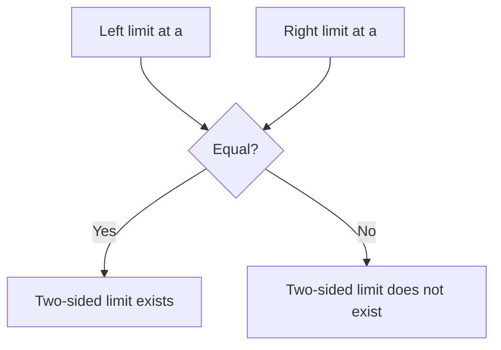

# Day 3 — Limits: informal idea, one-sided limits, limit laws

## Day objectives

- Distinguish \(\lim_{x\to a}f(x)\) from \(f(a)\): limits describe **near-\(a\)** behavior.
- Compute limits using **algebra** (cancellation) when direct substitution yields \(0/0\) for rational expressions.
- Use **one-sided limits** \(\lim_{x\to a^-}\) and \(\lim_{x\to a^+}\) for piecewise rules and absolute value.

### Khan Academy

  <iframe width="560" height="315" src="https://www.youtube.com/embed/riXcZT2ICjA" title="Khan Academy: Introduction to limits" loading="lazy" allow="accelerometer; autoplay; clipboard-write; encrypted-media; gyroscope; picture-in-picture; web-share" referrerpolicy="strict-origin-when-cross-origin" allowfullscreen></iframe>

## Prime recall (answer before reading on)

1. If \(f(2)=5\) but the graph approaches height \(3\) as \(x\to 2\), what is \(\lim_{x\to 2}f(x)\) (if it exists)?
2. For \(\lim_{x\to a}f(x)\) to exist as a two-sided limit, what must match?

---

## Core concepts

**Informal limit:** \(\lim_{x\to a}f(x)=L\) means \(f(x)\) can be made arbitrarily close to \(L\) by taking \(x\) sufficiently close to \(a\) (often with \(x\neq a\)).

**Substitution trap:** If \(f\) is a rational expression and plugging \(x=a\) gives \(0/0\), try factoring and canceling a common factor of \((x-a)\) for \(x\neq a\), then substitute.

**One-sided limits:** \(\lim_{x\to a^-}f(x)\) uses \(x<a\) approaching \(a\); \(\lim_{x\to a^+}f(x)\) uses \(x>a\). The two-sided limit exists iff both exist and are equal.

**Limit laws (finite limits):** If \(\lim f=L\) and \(\lim g=M\) (at the same \(a\)), then \(\lim(f+g)=L+M\), \(\lim(fg)=LM\), and \(\lim(f/g)=L/M\) provided \(M\neq 0\).

<!-- FUTURE: slider x approaches a from left/right; readouts -->

## Figure 3 — Two-sided limit exists

**Takeaway:** A two-sided limit needs **agreement** from the left and right—unless \(a\) is an endpoint of a domain restriction.

### Visual

---

## Mini-challenge

**Prompt:** Let \(f(x)=\dfrac{x^2-4}{x-2}\) for \(x\neq 2\). Find \(\lim_{x\to 2}f(x)\) and explain why it is not determined by \(f(2)\) if \(f(2)\) were undefined.

Show one possible solution path

For \(x\neq 2\), \(\dfrac{x^2-4}{x-2}=\dfrac{(x-2)(x+2)}{x-2}=x+2\). Hence \(\lim_{x\to 2}(x+2)=4\). The limit depends on values near 2, not the point value—removable discontinuity if \(f(2)\) were missing or different.

---

## Active recall

1. Why can limits exist at points where the function is undefined?
2. If \(\lim_{x\to a^-}f(x)=1\) and \(\lim_{x\to a^+}f(x)=3\), does \(\lim_{x\to a}f(x)\) exist?
3. What algebraic feature commonly signals a **removable** discontinuity?

---

## Practice problems

### Problem 1

Evaluate \(\displaystyle \lim_{x\to 3}\frac{x^2-x-6}{x-3}\).

*Your work:*

Show solution

Factor: \(x^2-x-6=(x-3)(x+2)\). For \(x\neq 3\), the expression is \(x+2\to 5\).

### Problem 2

Let \(f(x)=\begin{cases}2x+1,& x<1\\ 4,& x=1\\ x^2,& x>1\end{cases}\). Find \(\lim_{x\to 1^-}f(x)\), \(\lim_{x\to 1^+}f(x)\), and decide if \(\lim_{x\to 1}f(x)\) exists.

*Your work:*

Show solution

Left: \(2(1)+1=3\). Right: \(1^2=1\). Since \(3\neq 1\), the two-sided limit does **not** exist.

---

## Cumulative review

- **Day 1:** Secant slope; average rate on \([a,b]\).
- **Day 2:** Difference quotient; derivative limit definition.
- **Day 3:** Limits as near-\(a\) behavior; one-sided limits; basic laws and factoring.

---

## Spaced repetition (today’s queue)

1. **(Day 2)** Write the limit definition of \(f'(a)\) using the \(x\to a\) form.
2. **(Day 1)** If \(f(0)=1\) and \(f(4)=9\), what is the average rate on \([0,4]\) for \(f(x)=2x+1\)? Verify with the formula.
