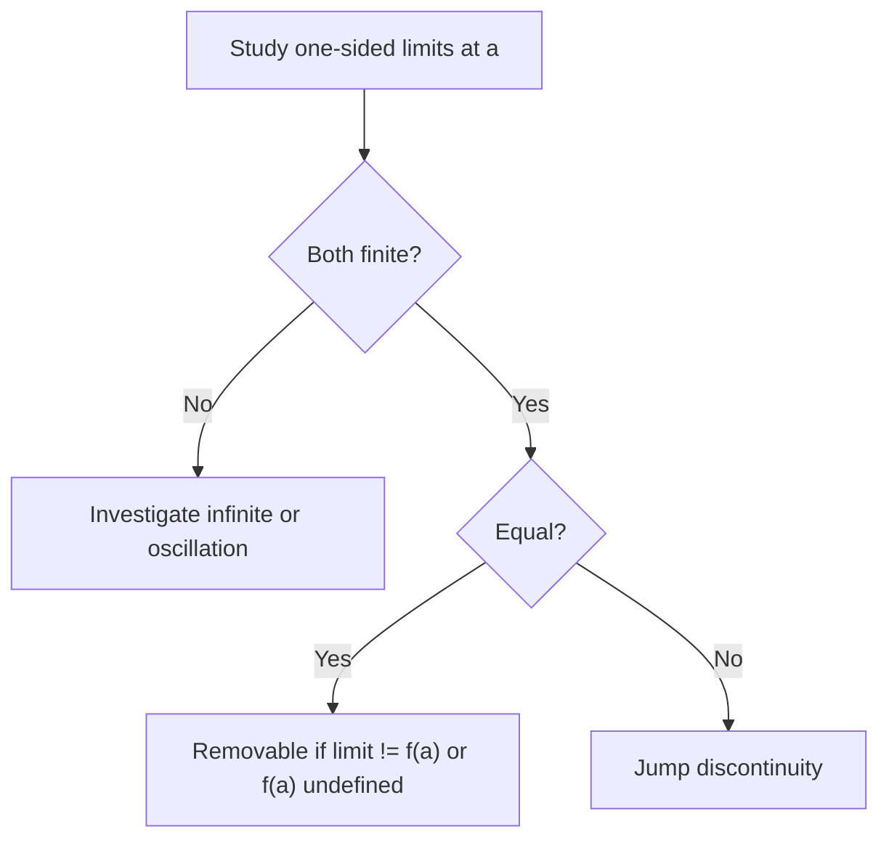

# Day 5 — Discontinuity types; connecting limits and graphs

## Day objectives

- Classify discontinuities as **removable**, **jump**, or **infinite** (and recognize oscillatory behavior as “limit fails” in examples).
- Translate between algebraic piecewise definitions and **one-sided** limit computations.
- Use sketches to predict limit behavior when formulas change across a boundary.

### Khan Academy

  <iframe width="560" height="315" src="https://www.youtube.com/embed/oUgDaEwMbiU" title="Khan Academy: Removing a removable discontinuity" loading="lazy" allow="accelerometer; autoplay; clipboard-write; encrypted-media; gyroscope; picture-in-picture; web-share" referrerpolicy="strict-origin-when-cross-origin" allowfullscreen></iframe>

## Prime recall (answer before reading on)

1. What pattern in limits indicates a **jump** discontinuity at \(a\)?
2. If \(\lim_{x\to a}f(x)\) exists but is not equal to \(f(a)\), what kind of discontinuity is typical?

---

## Core concepts

**Removable:** \(\lim_{x\to a}f(x)\) exists but either \(f(a)\) is undefined or \(\lim\neq f(a)\).

**Jump:** One-sided limits exist and are **finite** but **unequal**.

**Infinite:** At least one one-sided limit is infinite (vertical asymptote behavior), depending on definitions used in your text.

**Oscillatory (classic example):** \(f(x)=\sin(1/x)\) near \(0\) has no limit at \(0\) because values oscillate densely in \([-1,1]\).

**Piecewise discipline:** Always evaluate limits using the **branch that applies** just left vs just right of the break.

<!-- FUTURE: piecewise branch coloring on number line -->

## Figure 5 — Discontinuity classification (flow)

**Takeaway:** One-sided limits are the “sensor” that distinguishes jump vs removable vs asymptotic behavior.

### Visual

---

## Mini-challenge

**Prompt:** Define \(f(x)=\begin{cases}x+1,& x<0\\ 2,& x=0\\ x^2,& x>0\end{cases}\). Classify continuity at \(0\) with justification.

Show one possible solution path

\(\lim_{x\to 0^-}(x+1)=1\), \(\lim_{x\to 0^+}x^2=0\). One-sided limits disagree, so the two-sided limit does not exist. Hence \(f\) is **not** continuous at \(0\) (jump-type behavior).

---

## Active recall

1. Can a function have a limit at \(a\) if both one-sided limits are infinite with opposite signs?
2. Why is “limit exists” weaker than “continuous”?
3. Give a rational function with a vertical asymptote at \(x=2\) and describe the one-sided limits.

---

## Practice problems

### Problem 1

Let \(f(x)=\dfrac{|x|}{x}\) for \(x\neq 0\). Find \(\lim_{x\to 0^-}f(x)\) and \(\lim_{x\to 0^+}f(x)\). Does \(\lim_{x\to 0}f(x)\) exist?

*Your work:*

Show solution

For \(x<0\), \(|x|=-x\), so \(f(x)=-1\) and the left limit is \(-1\). For \(x>0\), \(|x|=x\), so \(f(x)=1\) and the right limit is \(1\). The two-sided limit does **not** exist.

### Problem 2

Sketch a function on \([-1,2]\) with a removable discontinuity at \(x=0\) and a jump at \(x=1\). Label which limits you intend.

*Your work:*

Show solution

Example idea: define \(f(x)=x^2\) for \(x\neq 0\) but \(f(0)=5\) (removable); then on \((1,2]\) shift the graph down so the right limit at \(1\) differs from the left limit approaching \(1\) from \((0,1)\). Many answers possible—grading focuses on correct one-sided behavior.

---

## Cumulative review

- **Days 1–2:** Average rate; derivative limit definition.
- **Days 3–5:** Limits, one-sided limits, continuity, discontinuity types.

---

## Spaced repetition (today’s queue)

1. **(Day 4)** State the three-part continuity definition at \(a\).
2. **(Day 3)** Factor and evaluate \(\lim_{x\to -1}\dfrac{x^2+3x+2}{x+1}\).
