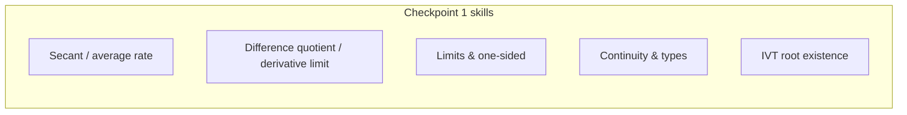

# Day 7 — Checkpoint 1 (limits and continuity)

## Day objectives

- Sit for a **mixed** skills check covering Days 1–6: rates, derivative-from-limits style algebra, limits (including one-sided), continuity classification, and IVT usage.
- Identify **one** topic to prioritize in your next SRS pass based on mistakes.

### Khan Academy

  <iframe width="560" height="315" src="https://www.youtube.com/embed/mols6pMKrto" title="Khan Academy: Limits from graphs" loading="lazy" allow="accelerometer; autoplay; clipboard-write; encrypted-media; gyroscope; picture-in-picture; web-share" referrerpolicy="strict-origin-when-cross-origin" allowfullscreen></iframe>

## Prime recall (answer before reading on)

1. Write the limit definition of \(f'(a)\) (either form).
2. State the three-part continuity test at \(a\).
3. State IVT in your own words, including where continuity is required.

---

## Core concepts

This day is assessment-focused. Skim [`../../controllers/checkpoint-schedule.md`](../../controllers/checkpoint-schedule.md) for scope, then attempt the checkpoint **without notes** first.

**Afterward:** Re-read only the sections in Days 1–6 that correspond to missed items.

---

## Figure 7 — Checkpoint coverage map

**Takeaway:** This checkpoint rewards **fluency** moving among graphs, limits, and theorems—not memorizing templates without meaning.

### Visual

---

## Mini-challenge

**Prompt:** Create a **3-problem mini-quiz** for a classmate using only topics from Days 1–6 (one limit computation, one continuity piecewise question, one IVT existence argument). Swap and grade.

Show one possible solution path

Example items:

1. \(\lim_{x\to 2}\dfrac{x^2-4}{x-2}\).
2. Continuity at \(x=0\) for a piecewise linear/quadratic rule with a parameter \(k\).
3. Show a cubic has a root in \((0,1)\) via a sign change.

Keep solutions separate when swapping.

---

## Active recall

_No separate list today—use the checkpoint as your recall event._

---

## Checkpoint test (Days 1–6)

**Instructions:** Attempt all problems **without looking ahead**. Only then open the solution details at the bottom.

### Problem A — Average rate

For \(f(x)=\sqrt{x}\), find the average rate of change on \([1,9]\).

*Your work:*

### Problem B — Derivative from definition

Use the limit definition to compute \(f'(a)\) for \(f(x)=x^2+3x\) at a general point \(a\) (your answer should be an expression in \(a\)).

*Your work:*

### Problem C — Limit with cancellation

Evaluate \(\displaystyle \lim_{x\to 4}\frac{x^2-2x-8}{x-4}\).

*Your work:*

### Problem D — One-sided limits

Let \(f(x)=\begin{cases}3-x,& x<1\\ 2,& x=1\\ x^2,& x>1\end{cases}\). Compute \(\lim_{x\to 1^-}f(x)\), \(\lim_{x\to 1^+}f(x)\), and determine whether \(\lim_{x\to 1}f(x)\) exists.

*Your work:*

### Problem E — Continuity parameter

Find \(k\) so that \(g(x)=\begin{cases}kx+2,& x<2\\ x^2,& x\ge 2\end{cases}\) is continuous at \(x=2\).

*Your work:*

### Problem F — IVT

Show that \(h(x)=x^5+x-1\) has a root in \((0,1)\).

*Your work:*

---

## Cumulative review

- **Checkpoint 1** consolidates **Days 1–6** (rates through IVT).

---

## Spaced repetition (today’s queue)

After grading, write **five** micro-cards for topics you missed—definitions only, on an index card:

1. Average rate formula  
2. Derivative limit definition  
3. Limit laws / factoring move  
4. Continuity definition  
5. IVT hypotheses  

---

## Checkpoint solutions (hidden)

Show solutions A–F

**A.** \(\dfrac{f(9)-f(1)}{9-1}=\dfrac{3-1}{8}=\dfrac{1}{4}\).

**B.** \(\dfrac{f(a+h)-f(a)}{h}=\dfrac{(a+h)^2+3(a+h)-(a^2+3a)}{h}=\dfrac{2ah+h^2+3h}{h}=2a+3+h\to 2a+3\). So \(f'(a)=2a+3\).

**C.** Factor numerator: \(x^2-2x-8=(x-4)(x+2)\). For \(x\neq 4\), expression is \(x+2\to 6\).

**D.** Left: \(3-1=2\). Right: \(1^2=1\). Two-sided limit **does not exist**.

**E.** Left limit: \(2k+2\). Right value: \(4\). Need \(2k+2=4\Rightarrow k=1\).

**F.** \(h\) is continuous on \([0,1]\). \(h(0)=-1<0\) and \(h(1)=1>0\). By IVT, some \(c\in(0,1)\) satisfies \(h(c)=0\).

