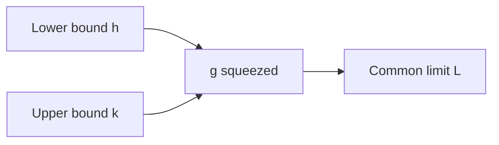

# Day 9 — Derivatives of sine and cosine; squeeze theorem (limits)

## Day objectives

- Know \(\dfrac{d}{dx}\sin x=\cos x\) and \(\dfrac{d}{dx}\cos x=-\sin x\) **with \(x\) in radians**.
- Use the squeeze theorem to evaluate limits like \(\lim_{x\to 0}\dfrac{\sin x}{x}=1\) (standard result; prove if your course requires the geometric argument).
- Combine trig derivatives with product/quotient rules.

### Khan Academy

  <iframe width="560" height="315" src="https://www.youtube.com/embed/Iur13MNO0Ro" title="Khan Academy: Derivatives of sin(x) and cos(x)" loading="lazy" allow="accelerometer; autoplay; clipboard-write; encrypted-media; gyroscope; picture-in-picture; web-share" referrerpolicy="strict-origin-when-cross-origin" allowfullscreen></iframe>

## Prime recall (answer before reading on)

1. Without differentiating yet: does the slope of \(\sin x\) at \(x=0\) “look like” 0 or 1 on the graph?
2. If \(-x^2\le g(x)\le x^2\) for all \(x\) near 0, what is \(\lim_{x\to 0}g(x)\)?

---

## Core concepts

**Trig derivatives (radians):**

\[
\frac{d}{dx}\sin x=\cos x,\qquad \frac{d}{dx}\cos x=-\sin x.
\]

(Extensions: \(\tan x=\sin x/\cos x\) via quotient rule gives \(\sec^2 x\), etc.)

**Squeeze theorem (informal):** If \(h(x)\le g(x)\le k(x)\) near \(a\) (except possibly at \(a\)) and \(\lim_{x\to a}h(x)=\lim_{x\to a}k(x)=L\), then \(\lim_{x\to a}g(x)=L\).

**Classic limit:** \(\lim_{x\to 0}\dfrac{\sin x}{x}=1\) (radians); often used to build other trig limits.

<!-- FUTURE: unit circle and small angle comparisons for sin x / x -->

## Figure 9 — Squeeze intuition

**Takeaway:** If a function is **trapped** between two approaching functions, it approaches the same limit.

### Visual

| Bound idea | In \(\sin x/x\) near 0 (sketch) |
|------------|----------------------------------|
| Geometry + inequalities | \(\cos x \le \dfrac{\sin x}{x}\le 1\) (one standard setup) |

---

## Mini-challenge

**Prompt:** Evaluate \(\lim_{x\to 0}\dfrac{1-\cos x}{x}\) using standard limits/algebra (hint: multiply by conjugate or use half-angle identity—choose a route your class allows).

Show one possible solution path

Multiply numerator and denominator by \(1+\cos x\):

\[
\frac{1-\cos x}{x}=\frac{1-\cos^2 x}{x(1+\cos x)}=\frac{\sin^2 x}{x(1+\cos x)}=\frac{\sin x}{x}\cdot \frac{\sin x}{1+\cos x}\to 1\cdot \frac{0}{2}=0.
\]

So the limit is \(0\).

---

## Active recall

1. Why do calculus trig formulas assume **radians**?
2. State the squeeze theorem precisely enough to apply it.
3. Differentiate \(x^2\cos x\) and \( \dfrac{\sin x}{x}\) (for \(x\neq 0\)) using rules you know.

---

## Practice problems

### Problem 1

Find \(\dfrac{d}{dx}(3\sin x - 2\cos x)\).

*Your work:*

Show solution

\(3\cos x + 2\sin x\).

### Problem 2

Evaluate \(\lim_{x\to 0}\dfrac{\sin(5x)}{x}\).

*Your work:*

Show solution

\(\dfrac{\sin(5x)}{x}=5\cdot \dfrac{\sin(5x)}{5x}\to 5\cdot 1=5\).

### Problem 3

Differentiate \(f(x)=\sin^2 x\) (write as \((\sin x)^2\) and use chain rule preview **or** product rule on \(\sin x\cdot \sin x\)).

*Your work:*

Show solution

Product rule: \(f'=2\sin x\cos x=\sin(2x)\). (Chain rule tomorrow will streamline powers of \(\sin x\).)

---

## Cumulative review

- **Days 1–7:** Limit foundations and checkpoint.
- **Day 8:** Basic differentiation rules.
- **Day 9:** Trig derivatives; squeeze theorem for limits.

---

## Spaced repetition (today’s queue)

1. **(Day 8)** Quotient rule for \(\dfrac{x}{x^2+1}\).
2. **(Day 5)** One-sided limits for a piecewise function at a break point.
3. **(Day 3)** Evaluate \(\lim_{x\to 1}\dfrac{x^2-1}{x-1}\).
