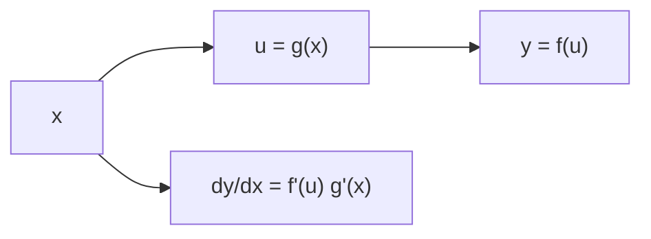

# Day 10 — Chain rule

## Day objectives

- Apply the **chain rule**: if \(y=f(u)\) and \(u=g(x)\), then \(\dfrac{dy}{dx}=f'(g(x))\,g'(x)\).
- Decompose compositions into **outer** and **inner** functions reliably.
- Combine chain rule with product/quotient rules in multistep problems.

### Khan Academy

  <iframe width="560" height="315" src="https://www.youtube.com/embed/0T0QrHO56qg" title="Khan Academy: Chain rule" loading="lazy" allow="accelerometer; autoplay; clipboard-write; encrypted-media; gyroscope; picture-in-picture; web-share" referrerpolicy="strict-origin-when-cross-origin" allowfullscreen></iframe>

## Prime recall (answer before reading on)

1. For \(h(x)=(x^2+1)^{50}\), what is a natural inner function \(u\)?
2. Why is \(\dfrac{d}{dx}(x^2+1)^{50}\) **not** \(50(x^2+1)^{49}\) by the power rule alone?

---

## Core concepts

**Chain rule (Leibniz form):** \(\dfrac{dy}{dx}=\dfrac{dy}{du}\cdot \dfrac{du}{dx}\).

**Nested functions:** Differentiate outside→inside, multiplying by derivatives of inners.

**Common pattern:** \(\dfrac{d}{dx}\bigl(g(x)\bigr)^n = n\bigl(g(x)\bigr)^{n-1}g'(x)\).

**Log/exponential chain forms (preview of Day 11):** \(\dfrac{d}{dx}e^{u(x)}=e^{u(x)}u'(x)\).

<!-- FUTURE: decomposition tree for composition -->

## Figure 10 — Outer-inner discipline

**Takeaway:** Always identify \(u=g(x)\); the derivative picks up **\(g'(x)\)** as a factor.

### Visual

---

## Mini-challenge

**Prompt:** Let \(h(x)=\sin(3x^2+1)\). Find \(h'(x)\) and check units if \(x\) were time (optional interpretation).

Show one possible solution path

Let \(u=3x^2+1\). Then \(h=\sin u\), so

\[
h'(x)=\cos(u)\cdot 6x=6x\cos(3x^2+1).
\]

Interpretation: \(3x^2+1\) is dimensionless if \(x\) is time only if constants carry units—usually \(x\) is dimensionless in pure calculus exercises.

---

## Active recall

1. What error does “derivative of outside times derivative of inside” prevent?
2. How many applications of chain rule might you need for \(f(g(h(x)))\)?
3. Differentiate \(\ln(x^2+1)\) once you know \(\dfrac{d}{dx}\ln x\) (preview Day 11)—set up \(u\) first.

---

## Practice problems

### Problem 1

Find \(\dfrac{d}{dx}\left[(x^3+2x)^7\right]\).

*Your work:*

Show solution

\(7(x^3+2x)^6(3x^2+2)\).

### Problem 2

Find \(\dfrac{d}{dx}\sin(\cos(x^2))\).

*Your work:*

Show solution

\(\cos(\cos(x^2))\cdot (-\sin(x^2))\cdot 2x=-2x\sin(x^2)\cos(\cos(x^2))\).

### Problem 3

Find \(\dfrac{d}{dx}\sqrt{1+x^4}\).

*Your work:*

Show solution

Write \(\sqrt{1+x^4}=(1+x^4)^{1/2}\). Derivative:

\[
\frac12(1+x^4)^{-1/2}\cdot 4x^3=\frac{2x^3}{\sqrt{1+x^4}}.
\]

---

## Cumulative review

- **Days 8–9:** Basic rules; trig; squeeze.
- **Day 10:** Chain rule for compositions.

---

## Spaced repetition (today’s queue)

1. **(Day 9)** \(\dfrac{d}{dx}(x\sin x)\).
2. **(Day 7)** Continuity: three-part test at a point.
3. **(Day 2)** From-scratch limit definition of derivative for \(x^2\) at \(x=1\).
