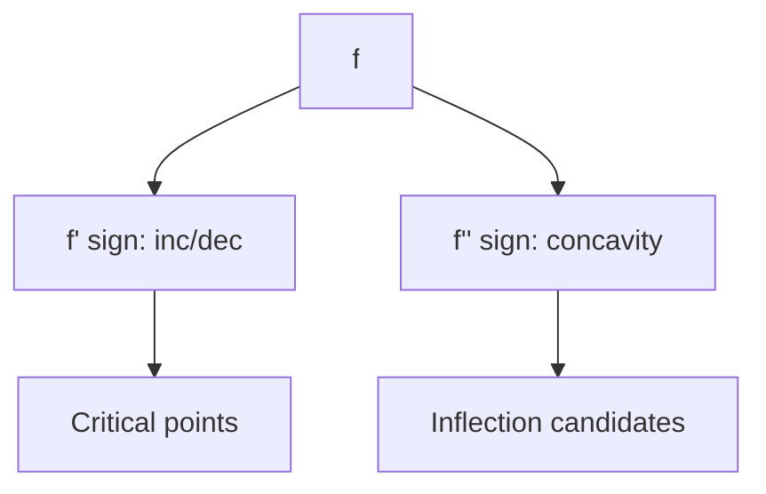

# Day 12 — Curve sketching: monotonicity and concavity (\(f'\) and \(f''\))

## Day objectives

- Use **sign of \(f'\)** to determine intervals where \(f\) increases/decreases; identify **local extrema** at critical points (where \(f'=0\) or \(f'\) undefined in domain interior).
- Use **sign of \(f''\)** to determine **concavity** and locate **inflection points** (where concavity changes, typically where \(f''\) changes sign under nice hypotheses).
- Organize information in a **sign chart** with domain restrictions.

### Khan Academy

  <iframe width="560" height="315" src="https://www.youtube.com/embed/x09FpMmGB4A" title="Khan Academy: Finding relative extrema (first derivative test)" loading="lazy" allow="accelerometer; autoplay; clipboard-write; encrypted-media; gyroscope; picture-in-picture; web-share" referrerpolicy="strict-origin-when-cross-origin" allowfullscreen></iframe>

## Prime recall (answer before reading on)

1. If \(f'(x)>0\) on \((a,b)\), what can you conclude about \(f\) on \((a,b)\)?
2. Can an inflection point occur where \(f''\) does not exist?

---

## Core concepts

**First derivative test (standard use):** Critical points partition the domain; sample \(f'\) in each subinterval to see increasing/decreasing. Local max/min often occur at critical points (compare endpoints for absolute extrema later).

**Second derivative test (one tool):** If \(f'(c)=0\) and \(f''(c)>0\), local min at \(c\); if \(f''(c)<0\), local max at \(c\); if \(f''(c)=0\), inconclusive—use first derivative test.

**Concavity:** \(f''>0\) means concave up (tangent below graph locally); \(f''<0\) means concave down.

**Inflection:** points where concavity changes; candidates where \(f''=0\) or \(f''\) DNE—verify sign change.

<!-- FUTURE: f, f', f'' stacked plots -->

## Figure 12 — Sign chart workflow

**Takeaway:** \(f'\) tells **story of slopes**; \(f''\) tells **story of slopes of slopes** (curvature).

### Visual

---

## Mini-challenge

**Prompt:** For \(f(x)=x^3-3x\), find all critical points, classify local extrema, find inflection points, and sketch.

Show one possible solution path

\(f'(x)=3x^2-3=3(x-1)(x+1)\). Critical points \(x=\pm 1\).

\(f''(x)=6x\). At \(x=-1\), \(f''<0\) ⇒ local max. At \(x=1\), \(f''>0\) ⇒ local min.

Inflection where \(f''\) changes sign: \(x=0\) (from \(-\) to \(+\)). Point \((0,0)\).

Sketch: cubic with local max at \(-1\), local min at \(1\), inflection at \(0\).

---

## Active recall

1. What is a **critical point** in Calculus I (interior domain version)?
2. Why is \(f''(c)=0\) not sufficient for an inflection point at \(c\)?
3. If \(f\) is increasing on \((0,2)\), must \(f''\) be positive there?

---

## Practice problems

### Problem 1

For \(g(x)=x e^{-x}\) (domain \(\mathbb{R}\)), find intervals of increase/decrease and concavity.

*Your work:*

Show solution

\(g'(x)=e^{-x}-xe^{-x}=e^{-x}(1-x)\). Critical point \(x=1\).

- \(x<1\): \(g'>0\) increasing; \(x>1\): \(g'<0\) decreasing.

\(g''(x)=\dfrac{d}{dx}\left(e^{-x}(1-x)\right)= -e^{-x}(1-x)+e^{-x}(-1)=e^{-x}(x-2)\).

Inflection candidate \(x=2\). Check sign: concave down on \((-\infty,2)\)? Actually \(e^{-x}>0\): \(g''<0\) for \(x<2\), \(g''>0\) for \(x>2\). Inflection at \(x=2\).

### Problem 2

Explain why a local maximum can occur where \(f''=0\) (give a simple example or condition).

*Your work:*

Show solution

Example: \(f(x)=-x^4\) has a local max at \(0\) with \(f''(0)=0\). Second derivative test is inconclusive; first derivative test confirms max.

---

## Cumulative review

- **Days 8–11:** Differentiation toolkit including chain/exp/log.
- **Day 12:** Graph behavior from \(f'\) and \(f''\).

---

## Spaced repetition (today’s queue)

1. **(Day 11)** \(\dfrac{d}{dx}\ln(5x)\).
2. **(Day 10)** Outer-inner decomposition for \(\cos(2x+1)\).
3. **(Day 7)** Removable discontinuity: what fails in the continuity definition?
