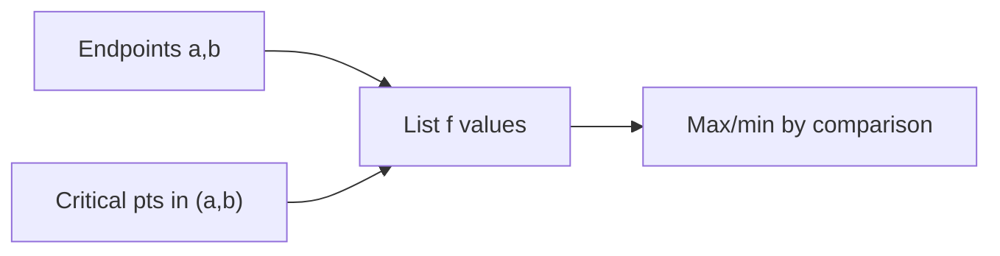

# Day 15 — Optimization on a closed interval

## Day objectives

- Solve **absolute max/min** problems on \([a,b]\) for continuous \(f\) using the **Extreme Value Theorem** mindset: candidates are **endpoints** and **critical points** in \((a,b)\).
- Translate word problems into \(f(x)\) with a **feasible domain** (interval constraints from geometry or context).
- Distinguish **local** vs **absolute** extrema and verify with comparisons.

### Khan Academy

  <iframe width="560" height="315" src="https://www.youtube.com/embed/dam16G6cZ8k" title="Khan Academy: Optimization — profit example" loading="lazy" allow="accelerometer; autoplay; clipboard-write; encrypted-media; gyroscope; picture-in-picture; web-share" referrerpolicy="strict-origin-when-cross-origin" allowfullscreen></iframe>

## Prime recall (answer before reading on)

1. If \(f\) is continuous on \([0,3]\), where can the absolute maximum occur?
2. Why must the interval be **closed** for the standard EVT guarantee on \([a,b]\)?

---

## Core concepts

**EVT:** If \(f\) is continuous on a closed bounded interval \([a,b]\), then \(f\) attains an absolute maximum and absolute minimum on \([a,b]\).

**Procedure on \([a,b]\):**

1. Find critical points: where \(f'(x)=0\) or \(f'\) undefined in \((a,b)\).
2. Evaluate \(f\) at endpoints \(a,b\) and all critical points in \((a,b)\).
3. Compare values.

**Modeling discipline:** Draw a diagram; express the quantity to optimize as a function of **one** variable using constraints; check domain.

<!-- FUTURE: rectangle in semicircle optimization slider -->

## Figure 15 — Candidate screening on \([a,b]\)

**Takeaway:** Optimization on a closed interval is a **finite comparison** after smoothness checks.

### Visual

---

## Mini-challenge

**Prompt:** A rectangle is inscribed in a semicircle of radius \(R\) with base on the diameter. Maximize the area.

Show one possible solution path

Place semicircle \(y=\sqrt{R^2-x^2}\). Rectangle width \(2x\), height \(\sqrt{R^2-x^2}\), area \(A(x)=2x\sqrt{R^2-x^2}\) for \(x\in[0,R]\). Differentiate:

\[
A'(x)=2\sqrt{R^2-x^2}+2x\cdot \frac{-2x}{2\sqrt{R^2-x^2}}
= \frac{2(R^2-x^2)-2x^2}{\sqrt{R^2-x^2}}=\frac{2(R^2-2x^2)}{\sqrt{R^2-x^2}}.
\]

Set \(A'=0\Rightarrow R^2-2x^2=0\Rightarrow x=R/\sqrt{2}\). Compare endpoints \(x=0,R\) (area 0). Max area at \(x=R/\sqrt{2}\).

---

## Active recall

1. Can an absolute maximum occur at a point where \(f'\) is undefined?
2. Why might a critical point fail to be a max or min?
3. What is a **constraint equation** in optimization?

---

## Practice problems

### Problem 1

Find the absolute max and min of \(f(x)=x^3-3x+2\) on \([0,2]\).

*Your work:*

Show solution

\(f'(x)=3x^2-3=3(x-1)(x+1)\). Critical point in \((0,2)\): \(x=1\).

Values: \(f(0)=2\), \(f(1)=0\), \(f(2)=8-6+2=4\). Absolute max \(4\) at \(x=2\); absolute min \(0\) at \(x=1\).

### Problem 2

A box with square base and open top has fixed volume \(V\). Minimize surface area—set up \(A(x)\) in terms of base side \(x\).

*Your work:*

Show solution

Let height be \(h\). Volume \(V=x^2h\Rightarrow h=V/x^2\). Surface area (open top): \(A=x^2+4xh=x^2+4V/x\), domain \(x>0\). Minimize \(A(x)\) using calculus on \((0,\infty)\) (often behavior at \(0^+\) and \(\infty\) shows a minimum exists).

---

## Cumulative review

- **Days 12–14:** Graph tests; asymptotes; implicit differentiation; Checkpoint 2.
- **Day 15:** Absolute extrema on closed intervals and modeling.

---

## Spaced repetition (today’s queue)

1. **(Day 14)** Implicit derivative of \(x^2+y^2=r^2\): find \(y'\).
2. **(Day 13)** Horizontal asymptote of \(\dfrac{3x+1}{\sqrt{4x^2+9}}\) as \(x\to\infty\) (careful with square roots).
3. **(Day 10)** Chain rule for \(\sqrt{1+x^2}\).
