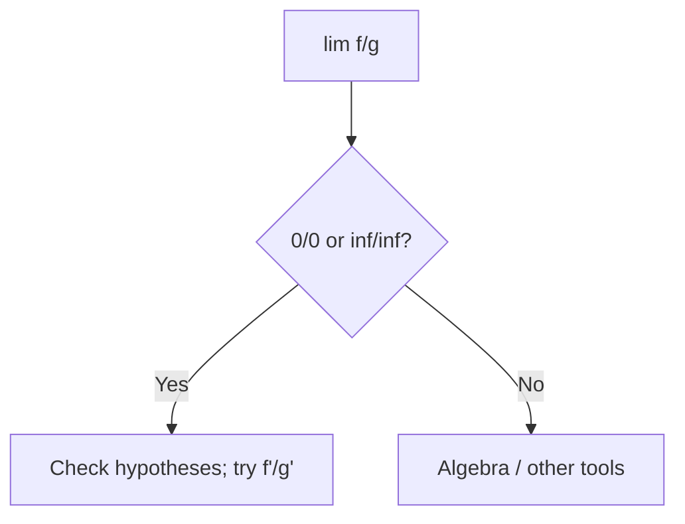

# Day 18 — L’Hôpital’s Rule

## Day objectives

- Apply L’Hôpital’s rule to indeterminate forms \(\dfrac{0}{0}\) and \(\dfrac{\infty}{\infty}\) under differentiability hypotheses near the limit point.
- Rewrite products and differences into quotient form when needed (\(0\cdot\infty\), \(\infty-\infty\)).
- Recognize when L’Hôpital **fails** or is unnecessary (algebra first; limit exists without it).

### Khan Academy

<div class="lesson-video" role="region" aria-label="Khan Academy lesson video">
  <iframe width="560" height="315" src="https://www.youtube.com/embed/PdSzruR5OeE" title="Khan Academy: Introduction to L'Hôpital's rule" loading="lazy" allow="accelerometer; autoplay; clipboard-write; encrypted-media; gyroscope; picture-in-picture; web-share" referrerpolicy="strict-origin-when-cross-origin" allowfullscreen></iframe>
</div>

## Prime recall (answer before reading on)

1. What indeterminate form is \(\lim_{x\to 0}\dfrac{\sin x}{x}\)?
2. If numerator and denominator both \(\to\infty\), what form is that?

---

## Runnable Python demo

Executable model script: [`../../models/python/day_18_lhopital.py`](../../models/python/day_18_lhopital.py) (numeric \(\sin x/x\) and \(f'/g'\) near \(0\)). From the project root:

```text
python models/python/day_18_lhopital.py
```

---

## Core concepts

**L’Hôpital (standard \(\dfrac{0}{0}\) or \(\dfrac{\infty}{\infty}\) at \(a\) or \(\infty\)):** Under hypotheses (differentiable near the point, denominator derivative nonzero in a punctured neighborhood as required), if \(\lim \dfrac{f}{g}\) is \(\dfrac{0}{0}\) or \(\dfrac{\infty}{\infty}\), then

\[
\lim \frac{f}{g}=\lim \frac{f'}{g'}
\]

**provided the right-hand limit exists or is \(\pm\infty\)** (as stated in your text).

**Algebra first:** Factor and cancel when possible; L’Hôpital is not a substitute for simplification.

**Other forms:** \(\ln\) tricks for \(0^0\), \(1^\infty\), \(\infty^0\) (transform via \(\ln\)).

<!-- FUTURE: iterate L'Hôpital counter where derivatives simplify -->

## Figure 18 — When to try L’Hôpital

**Takeaway:** Confirm **indeterminate form** first; then differentiate numerator and denominator **separately** (not quotient rule).

### Visual



---

## Mini-challenge

**Prompt:** Evaluate \(\lim_{x\to 0}\dfrac{e^x-1-x}{x^2}\).

<details>
<summary>Show one possible solution path</summary>

Form \(0/0\). Apply L’Hôpital: \(\dfrac{e^x-1}{2x}\) still \(0/0\). Again: \(\dfrac{e^x}{2}\to \dfrac{1}{2}\).

</details>

---

## Active recall

1. Why is \(\lim_{x\to 0}\dfrac{x^2}{x}\) **not** a place to use L’Hôpital blindly?
2. What goes wrong if you apply L’Hôpital to \(\dfrac{x}{x+1}\) as \(x\to\infty\) without checking form?
3. Give an example where limits exist but L’Hôpital oscillates without resolving.

---

## Practice problems

### Problem 1

Evaluate \(\lim_{x\to 0}\dfrac{\sin(4x)}{\tan(3x)}\).

*Your work:*


<details>
<summary>Show solution</summary>

\(0/0\). L’Hôpital: \(\dfrac{4\cos(4x)}{3\sec^2(3x)}\to \dfrac{4}{3}\).

</details>

### Problem 2

Evaluate \(\lim_{x\to\infty}\dfrac{\ln x}{\sqrt{x}}\).

*Your work:*


<details>
<summary>Show solution</summary>

\(\infty/\infty\). L’Hôpital: \(\dfrac{1/x}{1/(2\sqrt{x})}=\dfrac{2\sqrt{x}}{x}=\dfrac{2}{\sqrt{x}}\to 0\).

</details>

### Problem 3

Evaluate \(\lim_{x\to 0^+} x\ln x\) (rewrite as \(\dfrac{\ln x}{1/x}\)).

*Your work:*


<details>
<summary>Show solution</summary>

\(\infty/\infty\) form for \(\dfrac{\ln x}{1/x}\) as \(x\to 0^+\). L’Hôpital: \(\dfrac{1/x}{-1/x^2}=-x\to 0\).

</details>

---

## Cumulative review

- **Days 15–17:** Optimization; MVT; related rates.
- **Day 18:** Indeterminate forms and L’Hôpital.

---

## Spaced repetition (today’s queue)

1. **(Day 17)** Related rates: differentiate \(V=\frac{4}{3}\pi r^3\) with respect to \(t\).
2. **(Day 9)** \(\lim_{x\to 0}\dfrac{\sin x}{x}\) without L’Hôpital (known limit).
3. **(Day 13)** Identify vertical asymptotes after simplifying rationals.
