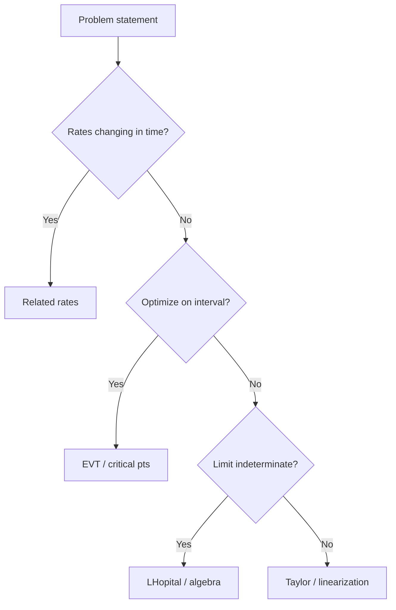

# Day 20 — Applications synthesis (bridge to Checkpoint 3)

## Day objectives

- Integrate **optimization**, **MVT**, **related rates**, **L’Hôpital**, and **Taylor polynomials** in mixed problems.
- Diagnose which tool fits a prompt **without** section headings as cues.
- Build stamina for **Checkpoint 3** (Day 21).

### Khan Academy

<div class="lesson-video" role="region" aria-label="Khan Academy lesson video">
  <iframe width="560" height="315" src="https://www.youtube.com/embed/Xe6YlrCgkIo" title="Khan Academy: Related rates — water in a cone" loading="lazy" allow="accelerometer; autoplay; clipboard-write; encrypted-media; gyroscope; picture-in-picture; web-share" referrerpolicy="strict-origin-when-cross-origin" allowfullscreen></iframe>
</div>

## Prime recall (answer before reading on)

1. Given a max/min story with a constraint, what is your first modeling step?
2. When you see \(\lim \dfrac{f}{g}\) with \(0/0\), what is your first check before L’Hôpital?

---

## Runnable Python demo

Executable model script: [`../../models/python/day_20_synthesis.py`](../../models/python/day_20_synthesis.py) (one short worked numeric per tool from Days 15–19). From the project root:

```text
python models/python/day_20_synthesis.py
```

---

## Core concepts

**Tool selection cues**

| Cue | Likely tool |
|-----|-------------|
| Best value on interval / story with constraint | EVT + critical points |
| “Some \(c\) where instantaneous equals average” | MVT |
| Time rates + geometric constraint | Related rates |
| Indeterminate limit of ratio | Algebra, then L’Hôpital |
| Match derivatives at a point with a polynomial | Taylor coefficients |

**Error control:** Revisit [`../../models/mistake-bank.md`](../../models/mistake-bank.md) items on related rates and L’Hôpital.

---

## Figure 20 — Mixed-flow decision (compact)

**Takeaway:** Read the **verb** in the prompt (“maximize,” “how fast,” “exists \(c\),” “limit,” “approximate”).

### Visual



---

## Mini-challenge

**Prompt:** Solve one optimization **and** one MVT problem back-to-back under a 25-minute timer; note any hesitation point for Day 21 review.

<details>
<summary>Show one possible solution path</summary>

Use any exercises from Days 15–19 you previously missed. The value is **timed decision speed**, not novelty.

</details>

---

## Active recall

1. Write a **one-sentence** MVT statement from memory.
2. Give the Taylor coefficient formula for the \(x^4\) term about \(a\).
3. List three related-rates mistakes from memory (signs, early substitution, missing chain).

---

## Practice problems (mixed)

### Problem 1

Find the point on \(y=\sqrt{x}\) closest to \((1,0)\) (minimize squared distance).

*Your work:*


<details>
<summary>Show solution</summary>

Distance squared \(D(x)=(x-1)^2+(\sqrt{x}-0)^2=(x-1)^2+x\). \(D'(x)=2(x-1)+1=2x-1\). Critical point \(x=1/2\). Compare endpoints/domain \(x\ge 0\): \(D(0)=1\), \(D(1/2)=1/4+1/2=3/4\), \(D(1)=1\). Minimum at \(x=1/2\), point \((1/2,1/\sqrt{2})\).

</details>

### Problem 2

Find \(c\in(0,1)\) for \(f(x)=x^3\) satisfying MVT.

*Your work:*


<details>
<summary>Show solution</summary>

Average slope \((1-0)/(1-0)=1\). \(f'(c)=3c^2=1\Rightarrow c=1/\sqrt{3}\in(0,1)\).

</details>

### Problem 3

Evaluate \(\lim_{x\to 1}\dfrac{x^3-1}{x^2-1}\) **without** L’Hôpital first; then verify with L’Hôpital.

*Your work:*


<details>
<summary>Show solution</summary>

Factor: \(\dfrac{(x-1)(x^2+x+1)}{(x-1)(x+1)}=\dfrac{x^2+x+1}{x+1}\to \dfrac{3}{2}\).

L’Hôpital: \(\dfrac{3x^2}{2x}\to \dfrac{3}{2}\).

</details>

---

## Cumulative review

- **Days 15–19:** Full application + approximation toolkit.
- **Day 20:** Mixed practice before Checkpoint 3.

---

## Spaced repetition (today’s queue)

1. **(Day 19)** Write \(P_2\) for \(\cos x\) at \(0\).
2. **(Day 15)** EVT candidate list on a closed interval.
3. **(Day 18)** Rewrite \(x\ln x\) as a quotient limit at \(0^+\).
