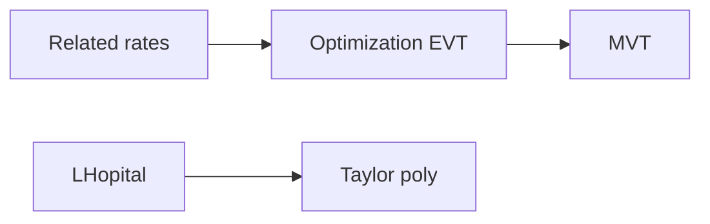

# Day 21 — Checkpoint 3 (applications and Taylor polynomials)

## Day objectives

- Complete a **timed-style** mixed exam on optimization, MVT, related rates, L’Hôpital, and Taylor polynomials (Days 15–20 scope).
- Record weak spots for targeted SRS in integration weeks.

### Khan Academy

<div class="lesson-video" role="region" aria-label="Khan Academy lesson video">
  <iframe width="560" height="315" src="https://www.youtube.com/embed/bGNMXfaNR5Q" title="Khan Academy: Mean value theorem review" loading="lazy" allow="accelerometer; autoplay; clipboard-write; encrypted-media; gyroscope; picture-in-picture; web-share" referrerpolicy="strict-origin-when-cross-origin" allowfullscreen></iframe>
</div>

## Prime recall (answer before reading on)

1. State the Extreme Value Theorem conclusion on \([a,b]\) for continuous \(f\).
2. Write the Taylor coefficient \(\dfrac{f^{(k)}(a)}{k!}\) role in words.
3. What must be true before applying L’Hôpital?

---

## Runnable Python demo

Executable model script: [`../../models/python/day_21_checkpoint3.py`](../../models/python/day_21_checkpoint3.py) (automated samples across MVT, limits, Taylor, optimization). From the project root:

```text
python models/python/day_21_checkpoint3.py
```

---

## Core concepts

Scope matches [`../../controllers/checkpoint-schedule.md`](../../controllers/checkpoint-schedule.md) Checkpoint 3. Attempt **without notes** first.

---

## Figure 21 — Checkpoint 3 topic web

**Takeaway:** These topics interlock: linear/Taylor approximation is derivative information; MVT connects average and instantaneous rates; optimization is critical-point analysis with domain constraints.

### Visual



---

## Mini-challenge

**Prompt:** In 10 minutes, write a **cheat-sheet micro-outline** (only five lines) for: related-rates steps, MVT solve-for-\(c\), L’Hôpital checklist, Taylor coefficient pattern.

<details>
<summary>Show one possible solution path</summary>

Example lines:

- Related rates: draw, equation, \(\dfrac{d}{dt}\), substitute last.
- MVT: compute average slope, set \(f'(c)\) equal, solve in open interval.
- L’Hôpital: verify \(0/0\) or \(\infty/\infty\), differentiate \(f\) and \(g\) separately, iterate if needed.
- Taylor: compute \(f^{(k)}(a)/k!\) for \(k=0..n\).

</details>

---

## Checkpoint test (Checkpoint 3)

### P1 — Optimization

Find the absolute maximum of \(f(x)=x^3-6x^2+9x\) on \([0,4]\).

*Your work:*


### P2 — MVT

Find all \(c\in(1,4)\) guaranteed by MVT for \(g(x)=\sqrt{x}\) on \([1,4]\).

*Your work:*


### P3 — Related rates

A kite 100 m above ground moves horizontally at 3 m/s. How fast is the string unwinding when 200 m of string is out? (Assume flat ground; use Pythagoras.)

*Your work:*


### P4 — L’Hôpital

Evaluate \(\lim_{x\to 0}\dfrac{e^x-e^{-x}-2x}{x-\sin x}\).

*Your work:*


### P5 — Taylor

Find \(P_2(x)\) for \(f(x)=\cos x\) centered at \(0\).

*Your work:*


### P6 — Mixed

A cylindrical can with volume \(V\) fixed has surface area \(A=2\pi r^2+2\pi rh\). Minimize \(A\) as a function of \(r\) after eliminating \(h\).

*Your work:*


---

## Cumulative review

- **Checkpoint 3** covers **Days 15–20**.

---

## Spaced repetition (today’s queue)

After grading: write **five** micro-prompts for missed topics and schedule them using [`../../controllers/srs-queue.md`](../../controllers/srs-queue.md).

---

## Checkpoint solutions (hidden)

<details>
<summary>Show solutions P1–P6</summary>

**P1.** \(f'(x)=3x^2-12x+9=3(x-1)(x-3)\). Critical points \(x=1,3\) in \([0,4]\). Evaluate: \(f(0)=0\), \(f(1)=4\), \(f(3)=27-54+27=0\), \(f(4)=64-96+36=4\). Absolute max is \(4\) at \(x=1\) and also at \(x=4\)? Wait \(f(4)=4\). So max value \(4\) at \(x=1\) and \(x=4\). Absolute min \(0\) at \(x=0\) and \(x=3\).

Double-check \(f(4)\): \(64-96+36=4\). Yes.

**P2.** Average slope \((2-1)/(4-1)=1/3\). \(g'(x)=\dfrac{1}{2\sqrt{x}}\). Set \(\dfrac{1}{2\sqrt{c}}=\dfrac{1}{3}\Rightarrow \sqrt{c}=3/2\Rightarrow c=9/4\in(1,4)\).

**P3.** Let horizontal distance be \(x\), string length \(L\). \(L^2=x^2+100^2\). Differentiate: \(2L L'=2x x'\Rightarrow L'=\dfrac{x x'}{L}\). When \(L=200\), \(x=\sqrt{200^2-100^2}=100\sqrt{3}\). Given \(x'=3\), \(L'=\dfrac{100\sqrt{3}\cdot 3}{200}=\dfrac{3\sqrt{3}}{2}\) m/s.

**P4.** \(0/0\). L’Hôpital: \(\dfrac{e^x+e^{-x}-2}{1-\cos x}\) still \(0/0\). Again: \(\dfrac{e^x-e^{-x}}{\sin x}\) still \(0/0\). Again: \(\dfrac{e^x+e^{-x}}{\cos x}\to 2\).

**P5.** \(f(0)=1\), \(f'(0)=0\), \(f''(0)=-1\). \(P_2(x)=1-\dfrac{x^2}{2}\).

**P6.** \(V=\pi r^2 h\Rightarrow h=V/(\pi r^2)\). Then

\[
A(r)=2\pi r^2 + 2\pi r\cdot \frac{V}{\pi r^2}=2\pi r^2+\frac{2V}{r}.
\]

Differentiate: \(A'(r)=4\pi r-\dfrac{2V}{r^2}=0\Rightarrow r^3=V/(2\pi)\Rightarrow r=\left(\dfrac{V}{2\pi}\right)^{1/3}\). (Second derivative test or first derivative sign analysis confirms minimum.)

</details>
