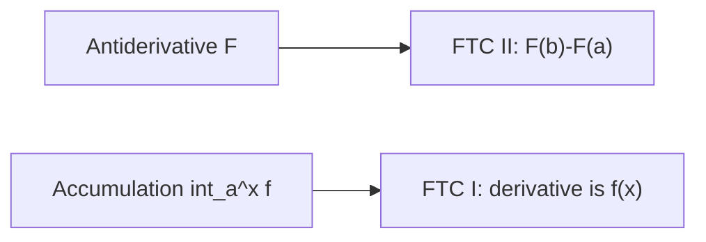

# Day 23 — Fundamental Theorem of Calculus (FTC I and II)

## Day objectives

- State **FTC II (evaluation):** if \(F'=f\) on \([a,b]\), then \(\int_a^b f(x)\,dx=F(b)-F(a)\).
- State **FTC I (differentiation of accumulation):** if \(f\) is continuous on an interval containing \(a\), then \(\dfrac{d}{dx}\int_a^x f(t)\,dt=f(x)\).
- Handle **variable limits** \(u(x)\) using the chain rule: \(\dfrac{d}{dx}\int_a^{u(x)}f(t)\,dt=f(u(x))u'(x)\).

### Khan Academy

<div class="lesson-video" role="region" aria-label="Khan Academy lesson video">
  <iframe width="560" height="315" src="https://www.youtube.com/embed/C7ducZoLKgw" title="Khan Academy: Fundamental theorem of calculus (part 1)" loading="lazy" allow="accelerometer; autoplay; clipboard-write; encrypted-media; gyroscope; picture-in-picture; web-share" referrerpolicy="strict-origin-when-cross-origin" allowfullscreen></iframe>
</div>

## Prime recall (answer before reading on)

1. If \(F'(x)=f(x)\), what is \(\int_a^b f(x)\,dx\)?
2. Why should \(\dfrac{d}{dx}\int_a^x f(t)\,dt\) return \(f(x)\) intuitively (“area under \(f\)” sensitivity)?

---

## Runnable Python demo

Executable model script: [`../../models/python/day_23_ftc.py`](../../models/python/day_23_ftc.py) (numeric difference quotient for \(F(x)=\int_0^x t^2\,dt\) vs \(f(x)=x^2\)). From the project root:

```text
python models/python/day_23_ftc.py
```

---

## Core concepts

**Antiderivatives:** \(F\) is an antiderivative of \(f\) if \(F'=f\). Indefinite integral \(\int f(x)\,dx\) denotes the family \(F+C\).

**FTC II:** Converts **area/accumulation** into **antiderivative evaluation** at endpoints.

**FTC I:** Differentiation undoes integration (for continuous integrands); explains antiderivative existence on intervals.

**Chain rule on limits:** Always multiply by \(\dfrac{du}{dx}\) when the upper limit is \(u(x)\).

<!-- FUTURE: area function A(x) and its slope matches f(x) -->

## Figure 23 — FTC I vs II roles

**Takeaway:** FTC II **evaluates** definite integrals; FTC I **constructs** antiderivatives and differentiates integrals.

### Visual



---

## Mini-challenge

**Prompt:** Compute \(\dfrac{d}{dx}\int_0^{x^2}\sin(t^2)\,dt\).

<details>
<summary>Show one possible solution path</summary>

By FTC I + chain: \(\sin((x^2)^2)\cdot 2x=2x\sin(x^4)\).

</details>

---

## Active recall

1. Why is continuity of \(f\) important for the clean FTC I statement?
2. What is wrong with \(\int_a^b f\) if \(f\) has a vertical asymptote inside \([a,b]\) without improper integral care?
3. Compute \(\dfrac{d}{dx}\int_x^{5} f(t)\,dt\) using properties of integrals.

---

## Practice problems

### Problem 1

Evaluate \(\int_1^4 \dfrac{1}{\sqrt{x}}\,dx\).

*Your work:*


<details>
<summary>Show solution</summary>

Antiderivative \(2\sqrt{x}\). Value \(2\sqrt{4}-2\sqrt{1}=4-2=2\).

</details>

### Problem 2

Find \(\dfrac{d}{dx}\int_{2x}^{3x} t^3\,dt\) by splitting \(\int_a^{3x}-\int_a^{2x}\) or differentiating directly (Leibniz).

*Your work:*


<details>
<summary>Show solution</summary>

Let \(F\) be antiderivative \(t^4/4\). Then \(\dfrac{d}{dx}(F(3x)-F(2x))=F'(3x)\cdot 3-F'(2x)\cdot 2=3(3x)^3-2(2x)^3=81x^3-16x^3=65x^3\).

</details>

### Problem 3

If \(G(x)=\int_1^x \dfrac{\sin t}{t}\,dt\), find \(G'(x)\).

*Your work:*


<details>
<summary>Show solution</summary>

\(G'(x)=\dfrac{\sin x}{x}\) for \(x\neq 0\) (and extend by continuity at 0 if defined).

</details>

---

## Cumulative review

- **Day 22:** Riemann sums / net area meaning.
- **Day 23:** FTC connects antiderivatives, derivatives, and definite integrals.

---

## Spaced repetition (today’s queue)

1. **(Day 22)** Express \(\Delta x\) for \([1,5]\) with \(n\) subintervals.
2. **(Day 18)** \(\lim_{x\to 0}\dfrac{1-\cos x}{x^2}\) (L’Hôpital twice).
3. **(Day 11)** \(\dfrac{d}{dx}\ln|x|\).
