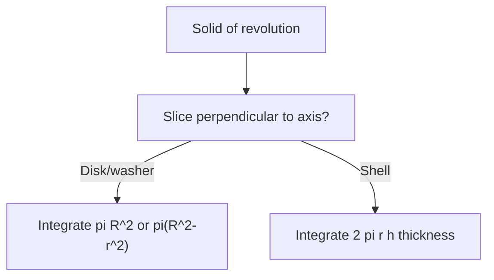

# Day 26 — Area between curves; volume by disks, washers, and shells

## Day objectives

- Set up \(\int_a^b \bigl(f(x)-g(x)\bigr)\,dx\) for area between graphs on intervals where **top/bottom** order is fixed; **split** at intersections when it changes.
- Set up volume integrals for **solids of revolution** using disks/washers and **cylindrical shells** (choose \(dx\) vs \(dy\) by slicing strategy).
- Draw one **representative slice** and label radius/height/thickness.

### Khan Academy

<div class="lesson-video" role="region" aria-label="Khan Academy lesson video">
  <iframe width="560" height="315" src="https://www.youtube.com/embed/wQXYtsyfbqg" title="Khan Academy: Area between curves" loading="lazy" allow="accelerometer; autoplay; clipboard-write; encrypted-media; gyroscope; picture-in-picture; web-share" referrerpolicy="strict-origin-when-cross-origin" allowfullscreen></iframe>
</div>

## Prime recall (answer before reading on)

1. Why is area \(\int (f-g)\) only valid where \(f\ge g\)?
2. Disk vs washer: when do you subtract inner radius squared?

---

## Runnable Python demo

Executable model script: [`../../models/python/day_26_area_volume.py`](../../models/python/day_26_area_volume.py) (area between \(y=x\) and \(y=x^2\); disk volume for \(y=\sqrt{x}\)). From the project root:

```text
python models/python/day_26_area_volume.py
```

---

## Core concepts

**Area:** Find intersections; on each subinterval, integrate **top minus bottom** (vertical slices) or **right minus left** (horizontal slices if \(x\) as function of \(y\) is easier).

**Disk (revolve \(y=f(x)\) about \(x\)-axis):** \(V=\pi\int_a^b [f(x)]^2\,dx\) (nonnegative \(f\) in setup).

**Washer:** \(V=\pi\int_a^b \left(R(x)^2-r(x)^2\right)\,dx\).

**Shells (about vertical axis example):** \(V=2\pi\int_a^b (\text{radius})(\text{height})\,dx\)—match your textbook’s radius convention.

<!-- FUTURE: one disk stack visualization -->

## Figure 26 — Disk vs shell choice

**Takeaway:** Pick the method that avoids splitting into many pieces for the same solid.

### Visual



---

## Mini-challenge

**Prompt:** Region bounded by \(y=x\) and \(y=x^2\) in the first quadrant is revolved about the \(x\)-axis. Set up the volume integral using disks/washers.

<details>
<summary>Show one possible solution path</summary>

Intersections: \(x=x^2\Rightarrow x=0,1\). On \([0,1]\), line is above parabola? At \(x=0.5\), \(x=0.5\), \(x^2=0.25\) so line is above.

Washer: outer \(R=x\), inner \(r=x^2\):

\[
V=\pi\int_0^1 \left(x^2-(x^2)^2\right)\,dx=\pi\int_0^1 (x^2-x^4)\,dx.
\]

Evaluate: \(\pi\left[\dfrac{x^3}{3}-\dfrac{x^5}{5}\right]_0^1=\pi\left(\dfrac13-\dfrac15\right)=\dfrac{2\pi}{15}\).

</details>

---

## Active recall

1. What is the “height” in the shell method for a region bounded by two curves?
2. When is \(dy\) integration preferable to \(dx\)?
3. Units check: why should volume integrand have dimension length\(^3\) after \(\int dx\)?

---

## Practice problems

### Problem 1

Find the area between \(y=x^2\) and \(y=2x\).

*Your work:*


<details>
<summary>Show solution</summary>

Intersections \(x^2=2x\Rightarrow x=0,2\). On \([0,2]\), \(2x\ge x^2\).

\[
A=\int_0^2 (2x-x^2)\,dx=\left[x^2-\frac{x^3}{3}\right]_0^2=4-\frac{8}{3}=\frac{4}{3}.
\]

</details>

### Problem 2

The region under \(y=\sqrt{x}\) from \(x=0\) to \(x=4\) is revolved about the \(x\)-axis. Find the volume.

*Your work:*


<details>
<summary>Show solution</summary>

Disks: \(V=\pi\int_0^4 (\sqrt{x})^2\,dx=\pi\int_0^4 x\,dx=\pi\left[\dfrac{x^2}{2}\right]_0^4=8\pi\).

</details>

### Problem 3

Set up (do not evaluate) volume of the solid obtained by rotating the region between \(y=x\) and \(y=x^2\) about the line \(y=-1\).

*Your work:*


<details>
<summary>Show solution</summary>

Use washers perpendicular to \(x\)-axis from \(x=0\) to \(1\). Distances to axis \(y=-1\):

\(R(x)=x-(-1)=x+1\), \(r(x)=x^2-(-1)=x^2+1\).

\[
V=\pi\int_0^1 \left[(x+1)^2-(x^2+1)^2\right]\,dx.
\]

</details>

---

## Cumulative review

- **Days 22–25:** Integrals, FTC, substitution, parts.
- **Day 26:** Geometric applications (area, volume).

---

## Spaced repetition (today’s queue)

1. **(Day 25)** \(\int x\ln x\,dx\) for \(x>0\).
2. **(Day 23)** Variable limit: \(\dfrac{d}{dx}\int_0^{x^2} e^{-t}\,dt\).
3. **(Day 14)** Implicit differentiation on \(x^2+y^2=1\).
