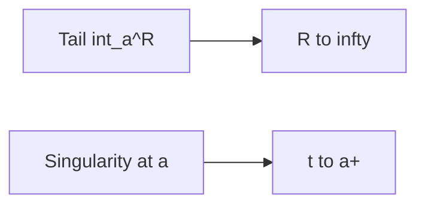

# Day 28 — Average value of a function; improper integrals; Checkpoint 4 (integration)

## Part A — Day objectives (content before checkpoint)

- Compute **average value** \(f_{\text{avg}}=\dfrac{1}{b-a}\int_a^b f(x)\,dx\) and relate to the Mean Value Theorem for integrals (existence of \(c\) with \(f(c)=f_{\text{avg}}\) under continuity).
- Evaluate **improper** integrals: infinite intervals and integrands unbounded at endpoints, using limits.
- Recognize basic **\(p\)-integral** convergence on \([1,\infty)\) for \(\int_1^\infty x^{-p}\,dx\).

### Khan Academy

<div class="lesson-video" role="region" aria-label="Khan Academy lesson video">
  <iframe width="560" height="315" src="https://www.youtube.com/embed/0rzL08BHr5c" title="Khan Academy: Average value of a function on an interval" loading="lazy" allow="accelerometer; autoplay; clipboard-write; encrypted-media; gyroscope; picture-in-picture; web-share" referrerpolicy="strict-origin-when-cross-origin" allowfullscreen></iframe>
</div>

## Prime recall (answer before reading on)

1. Why is average value **not** the same as \(\dfrac{f(b)-f(a)}{b-a}\)?
2. Write \(\int_1^\infty \dfrac{1}{x^p}\,dx\) as a limit.

---

## Runnable Python demo

Executable model script: [`../../models/python/day_28_improper_avg.py`](../../models/python/day_28_improper_avg.py) (average value of \(\sin x\) on \([0,\pi]\); \(p\)-integral tails via closed forms). From the project root:

```text
python models/python/day_28_improper_avg.py
```

---

## Core concepts (average value)

**Average value:** height of a constant function with the same net signed area over \([a,b]\):

\[
f_{\text{avg}}=\frac{1}{b-a}\int_a^b f(x)\,dx.
\]

**MVT for integrals:** If \(f\) is continuous on \([a,b]\), there exists \(c\in(a,b)\) with \(f(c)=f_{\text{avg}}\).

## Core concepts (improper integrals)

**Infinite tail:** \(\int_a^\infty f(x)\,dx=\lim_{R\to\infty}\int_a^R f(x)\,dx\).

**Singularity at endpoint:** \(\int_a^b f(x)\,dx\) with \(f\) blowing up at \(a\) means \(\lim_{t\to a^+}\int_t^b f(x)\,dx\).

**Split:** If discontinuity is inside \((a,b)\), split into two limits.

**\(p\)-test (standard facts):** \(\int_1^\infty x^{-p}\,dx\) converges if \(p>1\), diverges if \(p\le 1\). \(\int_0^1 x^{-p}\,dx\) converges if \(p<1\), diverges if \(p\ge 1\).

<!-- FUTURE: tail area slider R -->

## Figure 28A — Average value as balancing height

**Takeaway:** Average value balances signed area against interval length.

### Visual

| Geometric picture | Equation |
|-------------------|----------|
| Rectangle area matches \(\int_a^b f\) | \(f_{\text{avg}}(b-a)=\int_a^b f\) |

---

## Figure 28B — Improper integral as limit of proper pieces

**Takeaway:** Replace \(\infty\) (or singular point) with a parameter, integrate properly, then take limit.

### Visual



---

## Mini-challenge

**Prompt:** Determine whether \(\int_1^\infty \dfrac{1}{x^{3/2}}\,dx\) converges; if so, evaluate.

<details>
<summary>Show one possible solution path</summary>

\[
\lim_{R\to\infty}\int_1^R x^{-3/2}\,dx=\lim_{R\to\infty}\left[-2x^{-1/2}\right]_1^R=\lim_{R\to\infty}\left(-2R^{-1/2}+2\right)=2.
\]

Converges to \(2\).

</details>

---

## Active recall

1. If \(f\) is odd on \([-a,a]\), what is \(\int_{-a}^a f\) and what is the average value?
2. Why must \(\int_{-1}^1 \dfrac{1}{x^2}\,dx\) be treated as improper (and what goes wrong with blind evaluation)?
3. Does convergence of \(\int_a^\infty f\) require \(f(x)\to 0\)? (Calculus I answer: not a proof requirement, but good intuition.)

---

## Practice problems (Day 28 Part A)

### Problem 1

Find the average value of \(f(x)=x^2\) on \([0,3]\).

*Your work:*


<details>
<summary>Show solution</summary>

\[
\frac{1}{3}\int_0^3 x^2\,dx=\frac{1}{3}\left[\frac{x^3}{3}\right]_0^3=\frac{1}{3}\cdot 9=3.
\]

</details>

### Problem 2

Evaluate \(\int_0^\infty e^{-x}\,dx\).

*Your work:*


<details>
<summary>Show solution</summary>

\[
\lim_{R\to\infty}\int_0^R e^{-x}\,dx=\lim_{R\to\infty}(1-e^{-R})=1.
\]

</details>

### Problem 3

Evaluate \(\int_0^1 \dfrac{1}{\sqrt{x}}\,dx\) as an improper integral at \(0\).

*Your work:*


<details>
<summary>Show solution</summary>

\[
\lim_{t\to 0^+}\int_t^1 x^{-1/2}\,dx=\lim_{t\to 0^+}\left[2\sqrt{x}\right]_t^1=\lim_{t\to 0^+}(2-2\sqrt{t})=2.
\]

</details>

---

## Checkpoint test (Checkpoint 4 — integration unit)

**Instructions:** Attempt without notes first. Solutions only in the hidden block at the end.

### Q1 — Riemann / area meaning

Explain in one paragraph why \(\int_a^b f(x)\,dx\) counts signed area, and give an example where the integral is negative though \(f\) is sometimes positive.

*Your work:*


### Q2 — FTC

Compute \(\dfrac{d}{dx}\int_{x^2}^{e^x} \sin(t)\,dt\).

*Your work:*


### Q3 — Substitution

Evaluate \(\int_0^{\pi/2} \sin^2 x\cos x\,dx\).

*Your work:*


### Q4 — Parts

Evaluate \(\int_1^2 \ln x\,dx\).

*Your work:*


### Q5 — Area between curves

Find the area between \(y=x\) and \(y=x^3\) from \(x=0\) to \(x=1\).

*Your work:*


### Q6 — Volume

The region bounded by \(y=\sqrt{x}\), \(x=4\), and the \(x\)-axis is revolved about the \(x\)-axis. Find the volume.

*Your work:*


### Q7 — Improper integral

Determine convergence of \(\int_1^\infty \dfrac{1}{x}\,dx\).

*Your work:*


### Q8 — Average value

Find the average value of \(g(x)=3x^2\) on \([-1,2]\).

*Your work:*


---

## Cumulative review

- **Days 22–28:** Integration core + applications + improper ideas; **Checkpoint 4** consolidates.

---

## Spaced repetition (today’s queue)

1. **(Day 25)** \(\int xe^{-x}\,dx\) by parts.
2. **(Day 22)** Right Riemann sum setup for \(\int_1^3 x\,dx\) with \(n=4\) (only setup).
3. **(Day 27)** Write \(ds\) for \(y=\ln x\).

---

## Hidden solutions — Checkpoint Q1–Q8

<details>
<summary>Show solutions Q1–Q8</summary>

**Q1.** The definite integral is a limit of signed sums \(f(x_i^*)\Delta x\); regions below the \(x\)-axis contribute negative product \(f\Delta x\). Example: \(\int_{-1}^1 x\,dx=0\) even though \(f>0\) on part of the interval—cancellation.

**Q2.** For \(\dfrac{d}{dx}\int_{x^2}^{e^x}\sin(t)\,dt\), use \(\dfrac{d}{dx}\int_{u(x)}^{v(x)} f(t)\,dt=f(v)v'-f(u)u'\) with \(f=\sin\), \(v=e^x\), \(u=x^2\):

\[
\sin(e^x)\cdot e^x-\sin(x^2)\cdot 2x.
\]

**Q3.** Let \(u=\sin x\), \(du=\cos x\,dx\). \(\int_0^1 u^2\,du=\left[\dfrac{u^3}{3}\right]_0^1=\dfrac{1}{3}\).

**Q4.** \(\int \ln x\,dx=x\ln x-x\). Definite: \((2\ln 2-2)-(1\ln 1-1)=2\ln 2-1\).

**Q5.** On \([0,1]\), \(x\ge x^3\). Area \(\int_0^1 (x-x^3)\,dx=\left[\dfrac{x^2}{2}-\dfrac{x^4}{4}\right]_0^1=\dfrac{1}{4}\).

**Q6.** Disks: \(V=\pi\int_0^4 (\sqrt{x})^2\,dx=\pi\int_0^4 x\,dx=\pi\cdot 8=8\pi\).

**Q7.** \(\lim_{R\to\infty}\ln R=\infty\). Diverges.

**Q8.** Average \(\dfrac{1}{2-(-1)}\int_{-1}^2 3x^2\,dx=\dfrac{1}{3}[x^3]_{-1}^2=\dfrac{1}{3}(8-(-1))=3\).

</details>
