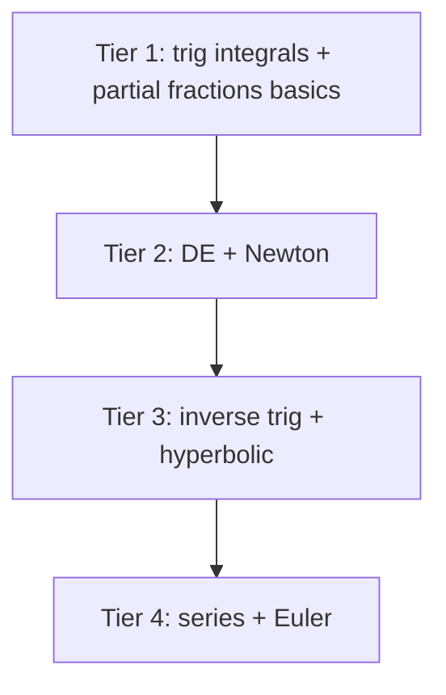

# Day 29 — Integration techniques and extensions (compact)

## Day objectives

- Execute **trigonometric integral** patterns for \(\int \sin^m x\cos^n x\,dx\) at basic depth (odd power peel; Pythagorean identities).
- Set up **partial fractions** for simple rational functions (linear factors; cover coefficients conceptually).
- Solve **separable** DE \(\dfrac{dy}{dt}=ky\) and perform **Newton’s method** steps.
- Skim **inverse trig derivatives**, **hyperbolic functions**, **Taylor series** viewpoint, and **Euler’s formula** as labeled **extension tiers** (depth varies by instructor).

### Khan Academy

<div class="lesson-video" role="region" aria-label="Khan Academy lesson video">
  <iframe width="560" height="315" src="https://www.youtube.com/embed/DL-ozRGDlkY" title="Khan Academy: Separable differential equations" loading="lazy" allow="accelerometer; autoplay; clipboard-write; encrypted-media; gyroscope; picture-in-picture; web-share" referrerpolicy="strict-origin-when-cross-origin" allowfullscreen></iframe>
</div>

## Prime recall (answer before reading on)

1. What identity reduces \(\sin^2 x\) and \(\cos^2 x\) to first power in trig integrals?
2. What algebraic precondition often precedes partial fractions on a rational function?

---

## Runnable Python demo

Executable model script: [`../../models/python/day_29_techniques.py`](../../models/python/day_29_techniques.py) (Newton’s method for \(\sqrt{2}\); values of \(e^x\) from \(y'=y\), \(y(0)=1\)). From the project root:

```text
python models/python/day_29_techniques.py
```

---

## Core concepts A — Trig integrals (powers)

**Odd power in sine:** peel one \(\sin x\) and set \(u=\cos x\), \(du=-\sin x\,dx\).

**Odd power in cosine:** peel one \(\cos x\) and set \(u=\sin x\).

**Both even:** use half-angle identities

\[
\sin^2 x=\frac{1-\cos 2x}{2},\qquad \cos^2 x=\frac{1+\cos 2x}{2}.
\]

## Core concepts B — Partial fractions

If \(\deg P\ge \deg Q\), do **polynomial division** first. Decompose proper \(\dfrac{P}{Q}\) into simpler terms; solve for coefficients by clearing denominators or plugging convenient \(x\) values.

**Quadratic irreducible factors** yield terms like \(\dfrac{Ax+B}{x^2+px+q}\).

## Core concepts C — Separable DE

\(\dfrac{dy}{dt}=ky\Rightarrow y=Ce^{kt}\). Constants from initial conditions.

## Core concepts D — Newton’s method

\[
x_{n+1}=x_n-\frac{f(x_n)}{f'(x_n)}.
\]

Avoid \(f'(x_n)\approx 0\); choose reasonable seeds.

## Extension tier E — Inverse trig / hyperbolic / series / complex (skim)

- **Inverse trig derivatives:** \(\dfrac{d}{dx}\arctan x=\dfrac{1}{1+x^2}\); domains of \(\arcsin,\arccos\).
- **Hyperbolic:** \(\cosh x=\dfrac{e^x+e^{-x}}{2}\), \(\sinh x=\dfrac{e^x-e^{-x}}{2}\), \(\dfrac{d}{dx}\sinh x=\cosh x\).
- **Taylor series:** extend polynomials to infinite series; radii of convergence (course-dependent).
- **Euler:** \(e^{i\theta}=\cos\theta+i\sin\theta\) links exponentials and trig in \(\mathbb{C}\).

<!-- FUTURE: partial fraction coefficient solver -->

## Figure 29 — Extension depth tiers

**Takeaway:** Day 29 is intentionally **modular**—master your instructor’s required tier first.

### Visual



---

## Mini-challenge

**Prompt:** Evaluate \(\int \sin^3 x\,dx\).

<details>
<summary>Show one possible solution path</summary>

Write \(\sin^3 x=\sin x(1-\cos^2 x)\). Let \(u=\cos x\), \(du=-\sin x\,dx\):

\[
\int -(1-u^2)\,du=-u+\frac{u^3}{3}+C=-\cos x+\frac{\cos^3 x}{3}+C.
\]

</details>

---

## Active recall

1. Why does partial fraction decomposition mirror “breaking denominators”?
2. What is the solution family of \(\dfrac{dy}{dt}=ky\)?
3. What is one failure mode for Newton’s method?

---

## Practice problems

### Problem 1

Evaluate \(\int_0^{\pi/2} \sin^2 x\,dx\) using a half-angle identity.

*Your work:*


<details>
<summary>Show solution</summary>

\(\sin^2 x=\dfrac{1-\cos 2x}{2}\).

\[
\int_0^{\pi/2}\frac{1-\cos 2x}{2}\,dx=\left[\frac{x}{2}-\frac{\sin 2x}{4}\right]_0^{\pi/2}=\frac{\pi}{4}.
\]

</details>

### Problem 2

Decompose \(\dfrac{1}{x^2-1}\) and integrate.

*Your work:*


<details>
<summary>Show solution</summary>

Factor: \(x^2-1=(x-1)(x+1)\).

\[
\frac{1}{x^2-1}=\frac{A}{x-1}+\frac{B}{x+1}.
\]

Solve \(A=\frac12\), \(B=-\frac12\). Integrate:

\[
\frac12\ln|x-1|-\frac12\ln|x+1|+C.
\]

</details>

### Problem 3

One Newton step for \(f(x)=x^2-2\) starting at \(x_0=1\).

*Your work:*


<details>
<summary>Show solution</summary>

\(f'(x)=2x\). \(x_1=1-\dfrac{-1}{2}=1.5\).

</details>

### Problem 4 (extension)

Verify \(\dfrac{d}{dx}\text{arcsin}(x)=\dfrac{1}{\sqrt{1-x^2}}\) from the inverse function theorem sketch.

*Your work:*


<details>
<summary>Show solution</summary>

If \(y=\arcsin x\) then \(x=\sin y\) and \(\dfrac{dx}{dy}=\cos y\). Hence \(\dfrac{dy}{dx}=\dfrac{1}{\cos y}=\dfrac{1}{\sqrt{1-x^2}}\) for \(y\in(-\pi/2,\pi/2)\) where \(\cos y>0\).

</details>

---

## Cumulative review

- **Days 22–28:** Core integration and Checkpoint 4.
- **Day 29:** Technique extensions and “end-of-course” topics in compact form.

---

## Spaced repetition (today’s queue)

1. **(Day 28)** Convergence of \(\int_1^\infty x^{-2}\,dx\).
2. **(Day 26)** Washer setup when rotating about \(y=-k\).
3. **(Day 18)** \(\lim_{x\to\infty}\dfrac{\ln x}{x}\).
