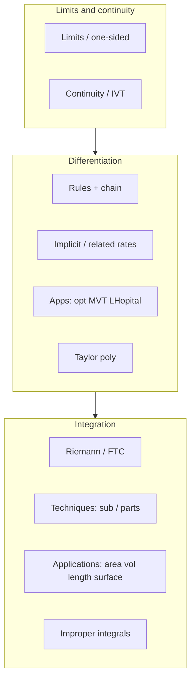

# Day 30 — Final comprehensive review (cheat-site capstone)

## Day objectives

- Traverse a **single-session** map of Calculus I: limits through integration applications.
- Drill **common mistakes** with quick fixes (see table below and [`../../models/mistake-bank.md`](../../models/mistake-bank.md)).
- Use the **cheat sheets** as last-minute reference without replacing understanding.

### Khan Academy

<div class="lesson-video" role="region" aria-label="Khan Academy lesson video">
  <iframe width="560" height="315" src="https://www.youtube.com/embed/EKvHQc3QEow" title="Khan Academy: Newton, Leibniz, and derivatives intro" loading="lazy" allow="accelerometer; autoplay; clipboard-write; encrypted-media; gyroscope; picture-in-picture; web-share" referrerpolicy="strict-origin-when-cross-origin" allowfullscreen></iframe>
</div>

## Prime recall (closed-book first)

1. Write the limit definition of \(f'(a)\).
2. State FTC I and FTC II in your own words.
3. Set up \(\int_a^b f(x)\,dx\) as a Riemann sum limit (informal but correct).

---

## Runnable Python demo

Executable model script: [`../../models/python/day_30_review.py`](../../models/python/day_30_review.py) (numeric limit, difference quotient, Riemann/trapezoid integrals). From the project root:

```text
python models/python/day_30_review.py
```

---

## Figure 30 — Concept map (Calculus I spine)

**Takeaway:** Differentiation studies local behavior (tangents, rates, optimization); integration studies accumulation (area, total change, advanced geometry).

### Visual



---

## Rapid reference — where to look

| Need | Document |
|------|----------|
| Limits, continuity, IVT | [`../cheat-sheets/limits-and-continuity.md`](../cheat-sheets/limits-and-continuity.md) |
| Derivative rules | [`../cheat-sheets/derivatives.md`](../cheat-sheets/derivatives.md) |
| FTC, substitution, parts, averages | [`../cheat-sheets/integrals-and-ftc.md`](../cheat-sheets/integrals-and-ftc.md) |
| Area/volume/length/surface/related rates setup | [`../cheat-sheets/applications-and-setup.md`](../cheat-sheets/applications-and-setup.md) |
| Taylor/DE/Newton/extras | [`../cheat-sheets/series-extras-and-de.md`](../cheat-sheets/series-extras-and-de.md) |

Full navigation: [`../../controllers/INDEX.md`](../../controllers/INDEX.md).

---

## Common mistakes — high frequency (exam day)

| Mistake | Quick fix |
|---------|-----------|
| Plugging \(h=0\) too early in derivative limits | Cancel \(h\) algebraically, then take limit |
| Confusing \(\lim_{x\to a}f(x)\) with \(f(a)\) | Use limits for near-\(a\) behavior; evaluate \(f(a)\) separately |
| Chain rule missing inner derivative | Name \(u\); include \(u'\) |
| Related rates: substitute numbers before differentiating | Differentiate first; substitute values last |
| L’Hôpital without \(0/0\) or \(\infty/\infty\) | Algebra first; rewrite indeterminate form |
| FTC I with \(u(x)\): forget \(u'\) | Multiply by \(u'(x)\) |
| Area between curves: wrong top/bottom | Sketch; split at crossings |
| Improper integral: skip limit at singularity | Split and approach with one-sided limits |
| Average value: forget \(\frac{1}{b-a}\) | Read as “area divided by base length” |

---

## Mini-challenge (timed)

**Prompt:** 45 minutes, no notes: pick **one** problem from each checkpoint day ([`day-07.md`](day-07.md), [`day-14.md`](day-14.md), [`day-21.md`](day-21.md), [`day-28.md`](day-28.md)) you have not solved cleanly yet. Grade strictly, then restudy only those topics.

<details>
<summary>Show one possible solution path</summary>

The value is **error localization**. Solutions already exist in those day files—use them only after an honest attempt.

</details>

---

## Active recall (final deck — sample)

1. Why does the MVT need differentiability on \((a,b)\) even if continuity holds on \([a,b]\)?
2. Give an example where \(\int_a^b f=0\) but \(f\) is not identically zero.
3. Disk vs shell: what question determines which setup is easier?
4. What is the \(p\)-test conclusion for \(\int_1^\infty x^{-p}\,dx\)?
5. Taylor \(P_2\) for \(e^x\) at \(0\)?
6. Newton update formula?
7. Separable DE \(\dfrac{dy}{dt}=ky\) solution?
8. Why can \(\sqrt{x^2}=|x|\) change limits at \(\pm\infty\)?

---

## Practice problems (final mixed set)

### Problem 1

Evaluate \(\lim_{x\to 0}\dfrac{\tan x - x}{x^3}\) (L’Hôpital carefully; may need multiple steps).

*Your work:*


<details>
<summary>Show solution</summary>

Apply L’Hôpital three times (check form each time):

\[
\frac{\sec^2 x - 1}{3x^2}=\frac{\tan^2 x}{3x^2}=\frac{1}{3}\left(\frac{\tan x}{x}\right)^2\to \frac{1}{3}.
\]

(Alternative algebra using \(\sec^2x-1=\tan^2x\).)

</details>

### Problem 2

Compute \(\int_0^{\pi/4} \sec^2 x\, e^{\tan x}\,dx\).

*Your work:*


<details>
<summary>Show solution</summary>

Let \(u=\tan x\), \(du=\sec^2 x\,dx\). Limits \(0\to 1\):

\[
\int_0^1 e^u\,du=e-1.
\]

</details>

### Problem 3

Find the volume when the region between \(y=x\) and \(y=x^2\) from \(0\) to \(1\) is revolved about the **\(y\)-axis** using shells.

*Your work:*


<details>
<summary>Show solution</summary>

Shell radius \(x\), height \(x-x^2\), \(x\in[0,1]\):

\[
V=2\pi\int_0^1 x(x-x^2)\,dx=2\pi\int_0^1 (x^2-x^3)\,dx
=2\pi\left[\frac{x^3}{3}-\frac{x^4}{4}\right]_0^1=2\pi\left(\frac{1}{3}-\frac{1}{4}\right)=\frac{\pi}{6}.
\]

</details>

---

## Cumulative review

- **Days 1–30:** This file is the **synthesis layer**—use prior days as the detailed archive.

---

## Spaced repetition (today’s queue)

Use [`../../controllers/srs-queue.md`](../../controllers/srs-queue.md): write **10** cards from your weakest topics discovered in the four checkpoints and re-run them over the next week.
